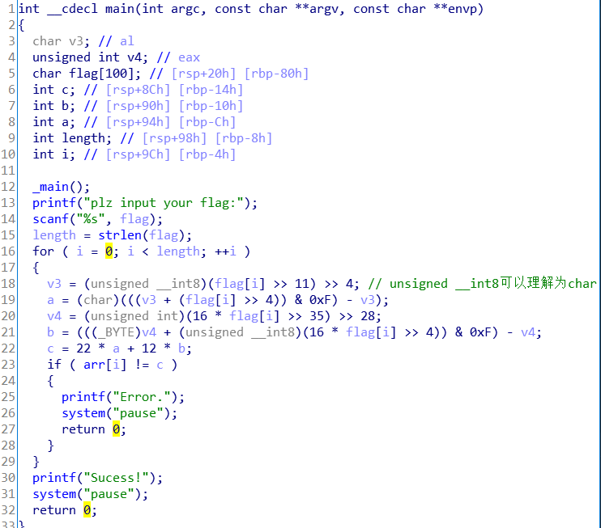

IDA静态分析一下，<kbd>F5<kbd/>反编译  
  
`unsigned __int8`一个八位的数，右移11位之多，可以判断v3==0，同理v4==0。  
然而似乎不容易得到逆推的公式，所以索性暴力破解
，**毕竟**，一个flag长不到哪去。  
```python
key = [160, 230, 122, 286, 230, 144, 290, 208, 240,
       144, 300, 216, 290, 244, 240, 100, 256, 310]

flag = ''
for i in range(18):
    for j in range(32, 127):
        a = (j>>4) & 0xF
        b = (16*j >> 4) & 0xF
        if (a * 22 + b * 12) == key[i]:
            flag += chr(j)

print(flag)
```

`key`即line:23那个`arr[]`，另外，破解代码`for j in range(32, 127)`原因是，ascii里边这些是可见字符，也是flag可能用上的字符，这样可以优化解密时间。

flag:`FZQ{Za_Jiang_MiAN}`